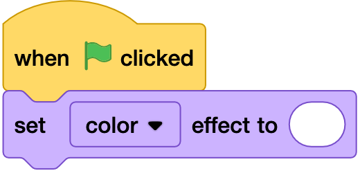
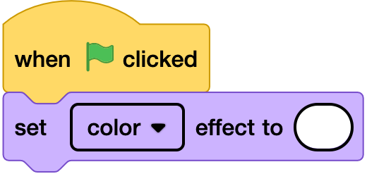

## Step graphics

### Scratch
- This directory should contain all the graphics for the code used in each step of the project.
- Blocks should be shown outlined and without an outline.
- Outlines can be created in [scratchblocks](https://scratchblocks.github.io/#?style=scratch3-high-contrast&script=), using `+` with the code

```
when flag clicked
```

  

```
+when flag clicked
```

  

- Outlines for parameters for some blocks should be black, 4px line width, with either 100% or 10px corner radii.

```
when flag clicked
set [color v] effect to ()
```




### Python/HTML
- For text languages it is sufficient to include a file with the code, broken into steps, or with comments to indicate how it is broken into steps.